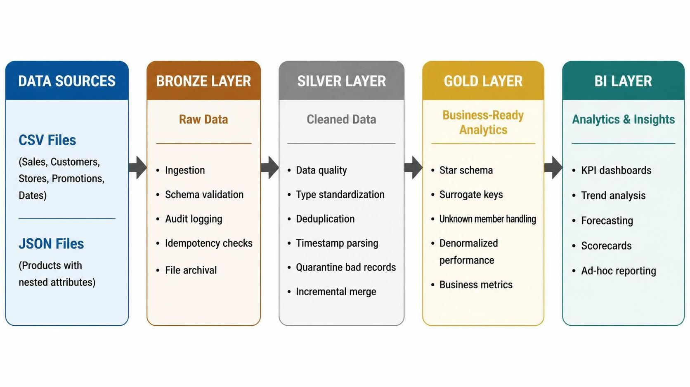
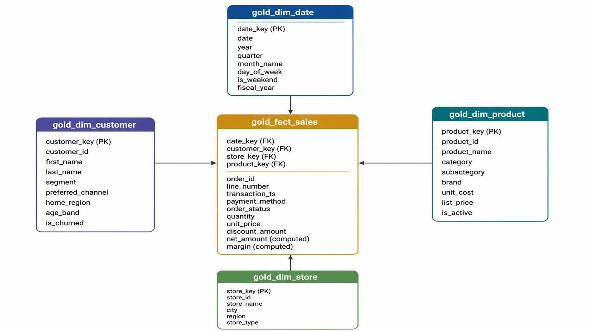

# Retail Data Warehouse - Project Documentation

## Table of Contents
1. [Project Objective](#project-objective)
2. [Architecture Overview](#architecture-overview)
3. [Data Model Design](#data-model-design)
4. [ETL Pipeline Design](#etl-pipeline-design)
5. [Visualization & Analytics](#visualizations-&-analytics)
6. [Key Features](#key-features)
7. [Data Quality & Governance](#data-quality-&-governance)
8. [Usage Guide](#usage-guide)
9. [Future Enhancements](#future-enhancements)
10. [Key Metrics Summary](#key-metrics-summary)

---

##  Project Objective 

### Business Purpose
This capstone project implements a **modern retail data warehouse**. The solution enables:

* **360° Business Intelligence**: Comprehensive analytics across products, customers, stores, and time dimensions
* **Real-time Decision Making**: Near real-time data pipeline supporting operational and strategic decisions
* **Data-Driven Insights**: KPI dashboards tracking sales performance, customer behavior, and operational metrics
* **Scalable Architecture**: Cloud-native design supporting business growth and increasing data volumes

### Key Business Questions Answered
1. What are our top-performing products and categories?
2. Which customer segments generate the most revenue?
3. How do different store locations and types perform?
4. What are the sales trends across time (daily, monthly, seasonal)?
5. What is our profit margin by product, category, and store?
6. Which payment methods and channels do customers prefer?
7. What is our order completion rate and return analysis?

---

##  Architecture Overview

### Medallion Architecture (Bronze → Silver → Gold)

The project follows Databricks' **medallion architecture** pattern, implementing a three-layer data lakehouse:

```


```

---

##  Data Model Design

### Star Schema Design

The gold layer implements a **classic star schema** optimized for analytical queries:

```


```

### Dimension Tables

#### 1. gold_dim_customer 
* **Purpose**: Customer demographics and segmentation
* **Surrogate Key**: `customer_key` (generated via ROW_NUMBER)
* **Business Key**: `customer_id`
* **Key Attributes**: segment (Consumer, Loyalty Member, Corporate), preferred_channel (In-Store, Online, Mobile App), age_band, is_churned
* **Unknown Handling**: customer_key = -1 for guest transactions

#### 2. gold_dim_product 
* **Purpose**: Product catalog and hierarchy
* **Surrogate Key**: `product_key`
* **Business Key**: `product_id`
* **Key Attributes**: 
  - category (Electronics, Home & Kitchen, Beauty & Health, Toys & Games, Apparel, Grocery)
  - subcategory, brand, unit_cost, list_price
* **Source**: JSON file with nested attributes (flattened in silver layer)

#### 3. gold_dim_store
* **Purpose**: Store locations and types
* **Surrogate Key**: `store_key`
* **Business Key**: `store_id`
* **Key Attributes**: region (East, West, Central, Online), store_type (Flagship, Standard, Express, Outlet, Online)

#### 4. gold_dim_date
* **Purpose**: Time intelligence and fiscal calendar
* **Primary Key**: `date_key` (integer YYYYMMDD format)
* **Key Attributes**:
  - Calendar: year, quarter, month, week, day
  - Business: fiscal_year (starts July 1), is_weekend, is_holiday
  - Labels: month_name, day_name, quarter_label
* **Generation**: Computed using CTE-based date generation (no external source)

### Fact Table

#### gold_fact_sales
* **Grain**: One row per sales transaction line item
* **Foreign Keys**: date_key, customer_key, store_key, product_key
* **Measures**:
  - `quantity`: Units sold
  - `unit_price`: Price per unit
  - `discount_amount`: Discount applied
  - **`net_amount`**: `quantity × unit_price - discount_amount` (computed)
  - **`margin`**: `net_amount - (quantity × unit_cost)` (computed)
* **Dimensions**: transaction_ts, payment_method (5 types), order_status (Completed, Returned, Cancelled), source_system
* **Total Revenue**: $185.9M with 37.5% average margin

---

##  ETL Pipeline Design

### Bronze Layer: Raw Data Ingestion

**Components:**
1. **File Discovery** (`find_file()`) - Locates dated files in volume
2. **Schema Validation** (`readCSVFile()`) - Applies predefined schemas
3. **Idempotency Check** (`isNotDuplicateFile()`) - Prevents duplicate processing
4. **Audit Logging** (`write_audit_record()`) - Tracks load history in `load_control` table
5. **File Archival** (`mvFileToProcessed()`) - Moves processed files

**Data Sources:**
* CSV: dim_store, dim_promotion, dim_date, dim_customer, fullload_sales, incremental_sales
* JSON: products.json (multi-line, nested structure)

**Processing Pattern:**
```python
for each source file:
    1. Discover file by pattern
    2. Validate against schema
    3. Check if already processed (date + filename)
    4. Write to bronze Delta table
    5. Log to audit table
    6. Move to processed folder
```

### Silver Layer: Data Quality & Transformation

**Transformations:**

1. **Standard Dimensions** (clean_df())
   - Remove duplicates
   - Drop all-null rows
   - Overwrite mode (full refresh)

2. **Sales Transactions** (clean_sales())
   - **Deduplication**: By order_id + line_number
   - **Timestamp Parsing**: Multiple format support (MM/dd/yyyy, M/d/yyyy, etc.)
   - **Type Conversions**: String → int, decimal
   - **Guest Handling**: NULL customer_id → -1
   - **Currency Cleaning**: Remove $ symbols
   - **Case Standardization**: INITCAP on status fields
   - **Data Quality Filters**:
     * quantity > 0
     * transaction_ts IS NOT NULL
     * unit_price IS NOT NULL
   - **Quarantine**: Invalid records → quarantine_sales table

3. **Products** (JSON parsing)
   - Multi-line JSON read
   - Nested attribute flattening (color, weight_kg, rating)
   - Type casting for costs and prices

**Incremental Processing:**

```python
Watermark-based incremental merge:
1. Get max(watermark_ts) from load_control
2. Filter bronze for rows > watermark
3. Apply data quality transformations
4. MERGE into silver (UPSERT on PK)
5. Update watermark to max(bronze_load_ts)
6. Log merge statistics
```

**Benefits:**
* Idempotent pipeline (safe to re-run)
* Incremental processing (performance optimization)
* Data lineage tracking
* Bad record quarantine (no data loss)

### Gold Layer: Dimensional Modeling

**Dimension Population:**
```sql
1. Generate surrogate keys using ROW_NUMBER() OVER (ORDER BY business_key)
2. Select business attributes from silver tables
3. UNION with Unknown member (key = -1)
4. CREATE TABLE AS SELECT (CTAS) for full refresh
```

**Fact Table Population:**
```sql
1. SELECT from silver_sales
2. LEFT JOIN all four dimensions on business keys
3. COALESCE foreign keys to -1 (referential integrity)
4. CAST date to integer key (YYYYMMDD)
5. Compute derived metrics (net_amount, margin)
6. CREATE TABLE AS SELECT
```

**Design Patterns:**
* **Surrogate Keys**: Stable integer keys (insulates from source changes)
* **Unknown Members**: -1 keys for missing/guest references
* **Conformed Dimensions**: Date dimension shared across potential future fact tables
* **Type 1 SCD**: Dimensions overwrite (current state only)
* **Computed Measures**: Pre-calculate in fact table for performance

---

##  Key Features

### 1. Idempotent Pipeline
* Duplicate detection prevents re-processing
* Safe to re-run without data corruption
* Audit table tracks all load events

### 2. Incremental Processing
* Watermark-based merge for sales fact table
* Only processes new bronze records
* Scales with data volume growth

### 3. Data Quality Enforcement
* Schema validation at ingestion
* Bad record quarantine (no data loss)
* Multi-format timestamp parsing
* Null handling and type conversions

### 4. Dimensional Modeling Best Practices
* Surrogate keys for stability
* Unknown members for referential integrity
* Conformed dimensions (reusable date dim)
* Pre-computed business metrics

### 5. Comprehensive Analytics
* 7 pre-built KPI views
* 7 interactive visualizations
* Multi-dimensional analysis ready
* Drilldown capability via star schema

### 6. Audit & Lineage
* load_control table tracks all ingestion
* Watermark timestamps for incremental loads
* File archival for data lineage
* Bronze timestamp for data freshness

---

##  Data Quality & Governance

### Data Quality Rules

**Bronze → Silver Validation:**
1. **Structural**: Valid timestamp format (multiple patterns supported)
2. **Business Logic**: Quantity > 0, unit_price NOT NULL
3. **Referential**: Customer -1 for guest transactions
4. **Deduplication**: order_id + line_number uniqueness
5. **Type Safety**: Explicit casting with error handling

**Silver → Gold Validation:**
1. **Completeness**: COALESCE foreign keys to -1 (no orphan facts)
2. **Consistency**: Date key format standardized (YYYYMMDD)
3. **Accuracy**: Margin calculation includes cost lookup
4. **Uniqueness**: Surrogate keys via ROW_NUMBER (deterministic)

### Governance Features

* **OneLake Security**: Provides centralized access control
* **Delta Lake**: ACID transactions, time travel enabled
* **Audit Trail**: Complete lineage from source file to gold table
* **Quarantine Process**: Bad records isolated for investigation
* **Schema Evolution**: Bronze tables support schema changes

---


##  Project Structure

```
msfabric_retail_proj/
├── README.md                          # This file
├── skillease_retail.ipynb             # Main notebook with all pipeline code
│
├── Data Sources (Unity Catalog Volume)
│   └── /Volumes/skillease/bronze/raw_csv/
│       ├── dim_customer_YYYY-MM-DD.csv
│       ├── dim_store_YYYY-MM-DD.csv
│       ├── dim_promotion_YYYY-MM-DD.csv
│       ├── dim_date_YYYY-MM-DD.csv
│       ├── fullload_sales_YYYY-MM-DD.csv
│       ├── incremental_sales_YYYY-MM-DD.csv
│       └── products.json
│
├── Bronze Layer Tables (skillease.bronze)
│   ├── bronze_sales
│   ├── bronze_customer
│   ├── bronze_store
│   ├── bronze_promotion
│   ├── bronze_date
│   ├── bronze_products
│   └── load_control (audit table)
│
├── Silver Layer Tables (skillease.bronze)
│   ├── silver_sales
│   ├── silver_customer
│   ├── silver_store
│   ├── silver_promotion
│   ├── silver_date
│   ├── silver_products
│   └── quarantine_sales
│
└── Gold Layer Tables (workspace.default or custom schema)
    ├── gold_dim_customer
    ├── gold_dim_product
    ├── gold_dim_store
    ├── gold_dim_date
    └── gold_fact_sales
```
